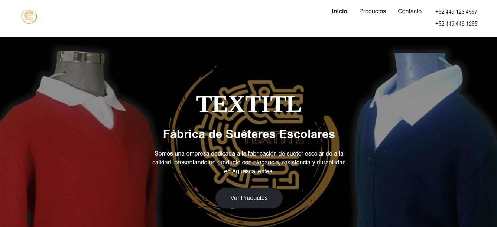
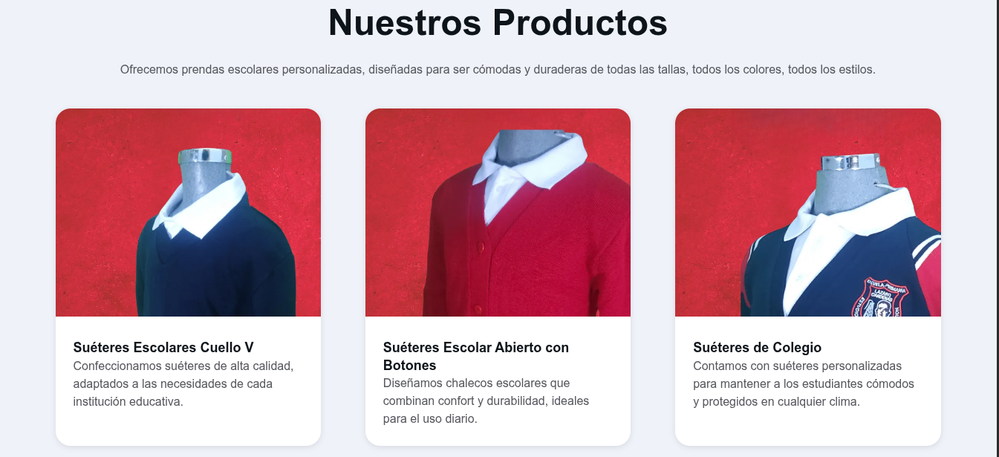

# ¡Hola! Soy Noé Alejandro.

## Desarrollador Full-Stack Junior | Aprendiz constante

### Sobre mí
Desarrollador full-stack junior, profesional en desarrollo con gran gusto y pasión por el desarrollo y la tecnología.
Aprendo y me adapto rápidamente a herramientas, lenguajes y entornos laborales nuevos.

### Tecnologías y Herramientas

<table width="100%">
    <tr style="border: solid #e4e2e251;">
        <td width="50%" style="border: solid #e4e2e251;">
            <strong><em>Back-End & Databases</em></strong>   
            
            
            
            
            
        </td>
        <td>
            <strong><em>Front-End</em></strong>  
            
            
            
            
            
        </td>
    </tr>
</table>

<table width="50%" align="center"> 
    <tr style="border: solid #e4e2e251;">
        <td>
            <strong><em>Herramientas de Desarrollo</em></strong>   
            
            
        </td>
    </tr>
</table>

### Proyectos Realizados

* **[Sistema Integral Administrativo, Financiero y Operativo de la
Producción](https://textitl.com)**: Encargado de desarrollar la landing page de la empresa y un software para la centralización de las necesidades de la empresa Textitl.

            

(El diseño fue hecho según lo deseado por el dueño de la empresa)

### Enfoque Actual

* Actualización y mantenimiento al software de la empresa Textitl.
* Desarrollando mi portfolio.
* Mejorar y perfeccionar mis habilidades de desarrollo.

### Contáctame En:

  

##

Desarrolla, crea y aprende sin limitarte por los obstáculos y siempre mirando hacia el futuro
